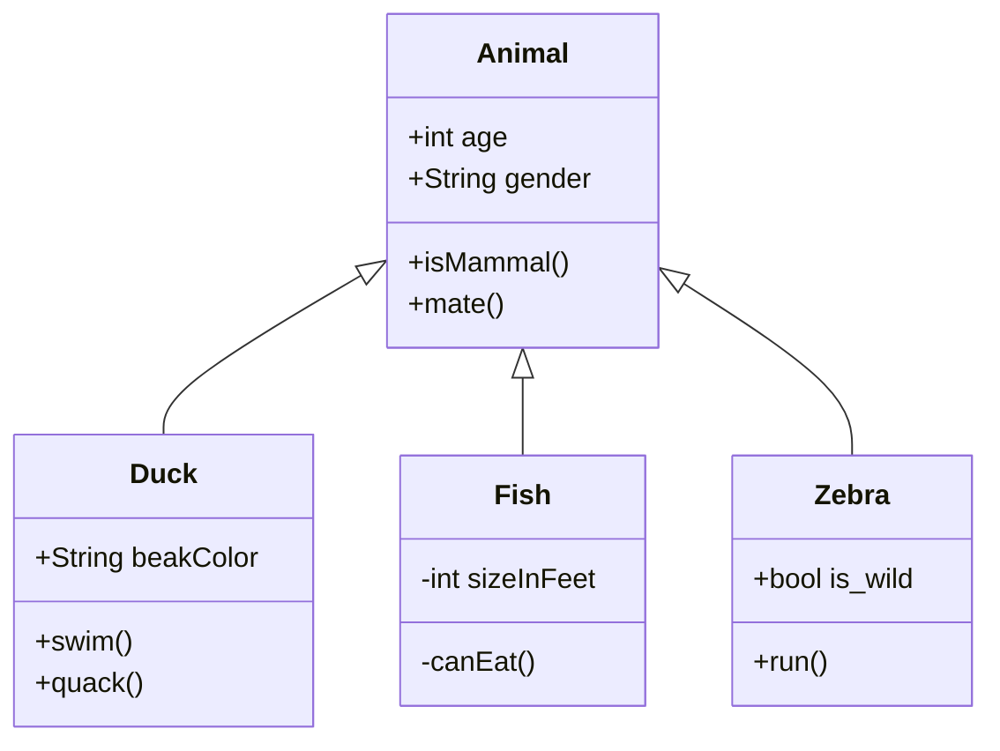

# Introduction
## 2nd Header
### 3rd Header
#### 4th Header
##### 5th Header
###### 6th Header

Hello world! This is blog 1.
$$f(x)=x^2$$
and this is inline math $x=17$.

and also this is a **bold text**

this is *italic text*

this is ***bold and italic***

> *"this is a quote"*

> **Note** that you can use _Markdown syntax_ within a blockquote.

> Don't communicate by sharing memory, share memory by communicating.  
> --- Rob Pike<cite>[^1]</cite>

[^1]: The above quote is excerpted from Rob Pike's [talk](https://www.youtube.com/watch?v=PAAkCSZUG1c) during Gopherfest, November 18, 2015.

```python
print("Hello World")
```

[This is a link to twitter](https://twitter.com)

